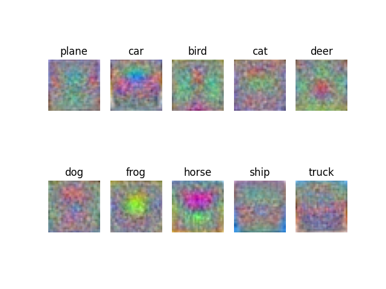

# SVM Image Classfier (cifar-10) 学习笔记

+ [CS231n Note SVM](https://cs231n.github.io/linear-classify/)

+ [CS231n Note SGD](https://cs231n.github.io/optimization-1/)

## 结果

+ 最优准确率 **39.80%**
  
  - 学习率 `3e-3`

  - 正则化参数 `1e-4`

  - 权重初始化 `np.random.randn(3073, 10) * 1e-3`
  
  - 对数据进行了简单归一化处理

+ 权重参数可视化

  - 我的结果

    

  - CS231n 参考

    

  + 可以看到图案形状基本是一致的，不过我的多了很多噪点，不知道是什么问题。

## 总结

+ emmmm，怎么说呢，总之把准确率搞到 39.8% 我已经燃尽了，比 kNN 高了一点点，其实也还行。

+ 总之代码写得还算顺利，大部分时间都在调参。

+ CS231n 提到的用 Random Local Search 有 21% 的准确率就很神奇，我怎么试都只有 12% 左右，跟完全随机没什么区别。

+ 到现在也觉得除了权重外的几个超参数就是玄学，包括 **正则化参数**，**学习率**，**权重初始化缩放常数**……总之完全是试出来的。

+ 可以感受到 SVM 真的比 kNN 效率高很多，**解析梯度** 比 **数值梯度** 效率高很多，虽然我还没完全搞懂解析梯度的推导过程，之后再慢慢研究吧。