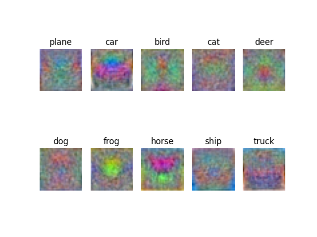

# Softmax Image Classfier (cifar-10) 学习笔记

+ [CS231n Note Softmax](https://cs231n.github.io/linear-classify/)

+ [CS231n Note SGD](https://cs231n.github.io/optimization-1/)

## 结果

+ 最优准确率 **41.20%**
  
  - 学习率 `2e-2`

  - 正则化参数 `1e-3`

  - 权重初始化 `np.random.randn(3073, 10) * 1e-3`
  
  - 对数据进行了简单归一化处理

+ 权重参数可视化

  - 我的结果

    

  - CS231n 参考

    

  - 最终图案其实和 SVM 差不多。但我发现在梯度还没完全收敛的时候，会得到一张和 CS231n 差不多的权重图，没有多余的噪点，颜色也一致，不过那个时候的准确率只有 37%

## 总结

+ Softmax 和 SVM 就差了个损失函数，整个实现过程就改了几行代码，没碰到什么问题。

+ CS231n 上说这两种分类器很多时候回得到一致的结果，实际上我得到的结果是 39.8%（SVM）和 41.2%（Softmax），Softmax稍微高了一点。