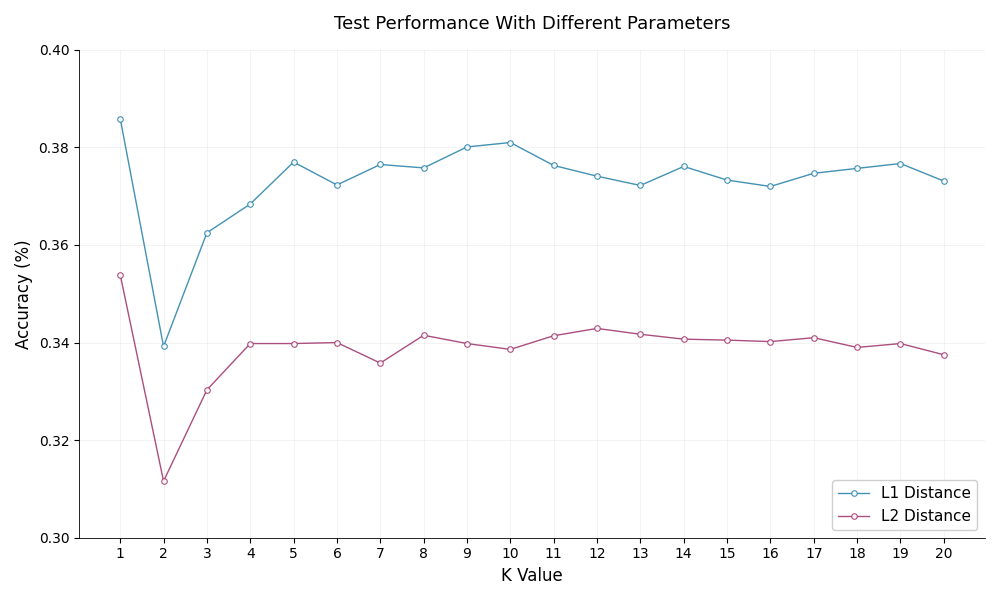
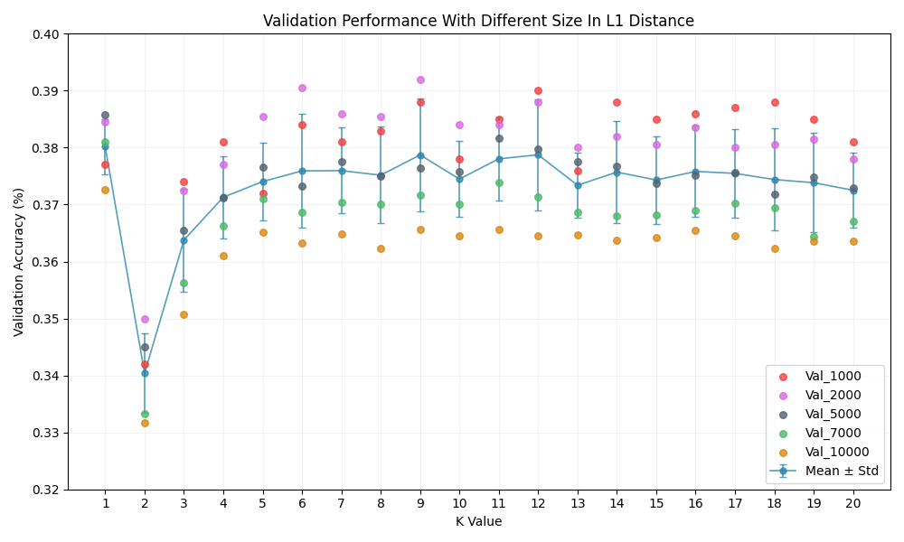
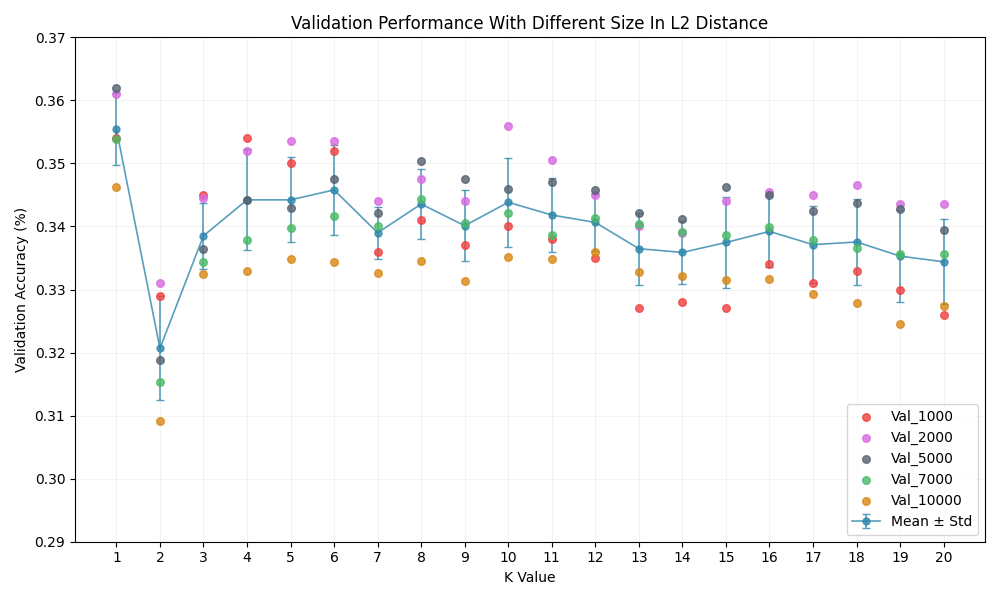

# kNN Image Classfier (cifar-10) 学习笔记

看完[CS231n Note](https://cs231n.github.io/classification/)后，纯手搓的kNN（基于Numpy实现），用于cifar-10数据集，仅满足实验作业需求。

## 实验结果

+ 最优结果

  | 参数 | 结果 | CS231n|
  |----- |------|------|
  | Metric=L1, K=1 | 38.59% | 38.6% |
  | Metric=L2, K=1 | 35.39% | 35.4% |

  可以看到，实际结果和 CS231n 在 Note 里提到的几乎一致。

+ 详细图表

  - 测试集结果

    

    可以看到，L1 距离在 cifar-10 上准确率总是高于 L2 距离。
    （到后面K值几乎没有影响了，其实应该试试更大的K值的，但是我不想重跑数据了）

  - 验证集结果

    
    

    假装画了个`errorbar`，其实根本没做交叉验证，数据来自不同的验证集大小，
    我也不知道画成这样能分析出什么来，
    但起码是可以看到验证集大小设置为5000的数据是最接近平均值的。
    （但是验证集是为了筛选最佳K值来着，实际准确率多少好像不是特别重要？）

## 心路历程

+ 看完 Note ，发现理论非常简单，直接从零开始搓代码！先写了核心代码，用小样本测试，比预想的还要顺利！

+ 于是……自信满满的开全数据测试，结果内存爆炸！**14.1TiB** 是什么鬼？！

+ 开始意识到广播机制不是万能的，会占用大量内存，开始尝试分批计算。（基于一个魔法数字的自动分批）。

+ 经过漫长的等待，终于跑出来一个结果了， **11.1%** 是什么鬼，这和随机有什么区别？！（实际上是因为有个地方 **变量名写错** 了）

+ 测试了几个K值后开始写验证集，感觉还是比较顺利的……结果跑半天跑不出结果，一看才发现我每计算一个K值都 **重新算了一次距离** 无敌了。。。

+ 终于调试成功后（不是当前结果）突然意识到我 **没有记录数据** ……开搞！

+ 最后终于可以智能管理历史数据了，虽然实现得比较丑陋，但好歹是能用了，于是开始疯狂测试不同的数据！

+ 然后我发现准确率只有 **25%左右** 看了下 Note 感觉我好像又双叒搞砸了……最后在查了一下，试了试 **归一化** 有奇效啊！直接提了 **10个百分点** ！

+ 事后发现其实只是数据类型的问题，归不归一无所谓，但是因为 float32 比 uint8 更占用内存，被迫升级了自动分批（其实就是改了个魔法数字）

+ 总之终于是搞完了，得到的结果我还是很满意的~（其实我 **没有搞交叉验证**，只用了 **固定验证集** ，但是感觉也足够选出最佳K值了，一开始我是看 Note 上说交叉验证效率低下，一般不用才没去搞，谁知道它的作业里有这个啊）

+ ……（一些莫名其妙的后续）

## 总结

+ ~~kNN 这辈子就这样了，我这辈子也就这样了~~

+ kNN 会忽略了图像的各种特征数据。

+ **要及时记录实验数据**

+ **不能因为是Python就不管内存问题**

+ **不能因为是Python就忽略了数据类型溢出的问题**
